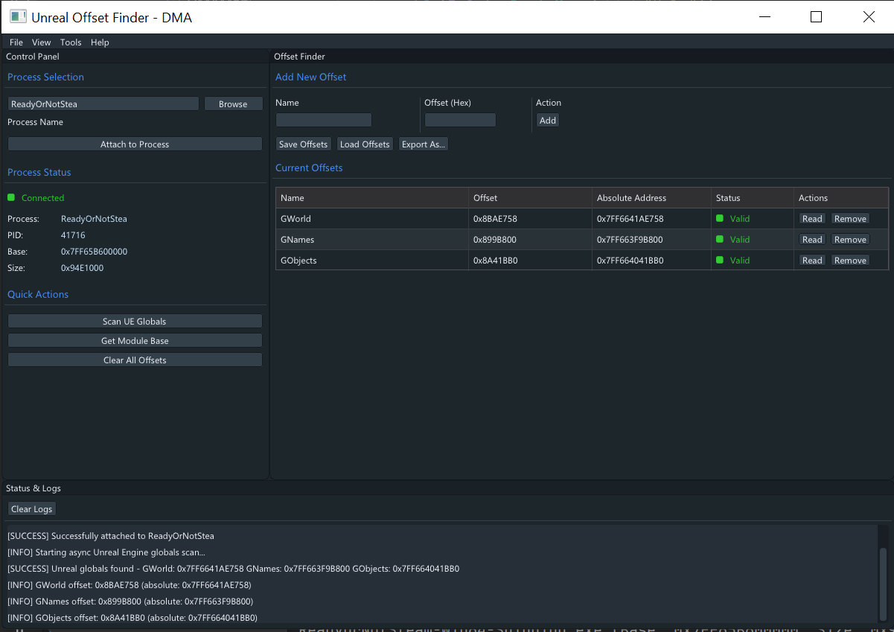

# Unreal Offset Finder - DMA

*A DMA-based tool for discovering Unreal Engine globals*

**Based on** [Do0K's GSpots project](https://github.com/Do0ks/GSpots)

**Requirements:** DMA (Direct Memory Access) card - without it you will not be able to run this tool.

**UI**: Using SFML and ImGUI.

**Functionality:** Scans process memory and RVA instructions to locate GWorld, GNames, and GObjects for Unreal Engine applications. Not all games are supported.

---

> **Disclaimer:** I do not promote using this project in any way for online game hacking. This was just a project I wanted to work on, as I thought the original concept was cool. :)

## Screenshots
**Below is a screenshot of using this on ReadyOrNot, and it finding the Unreal Globals**

Click to view interface

  

